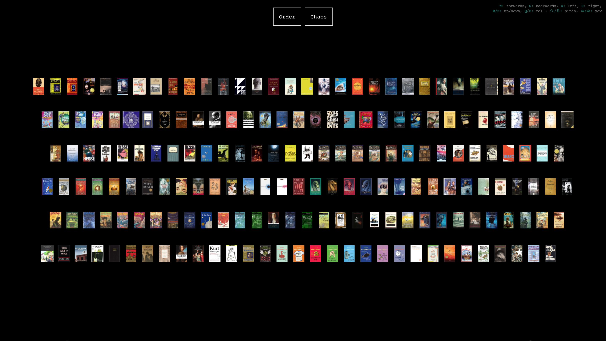
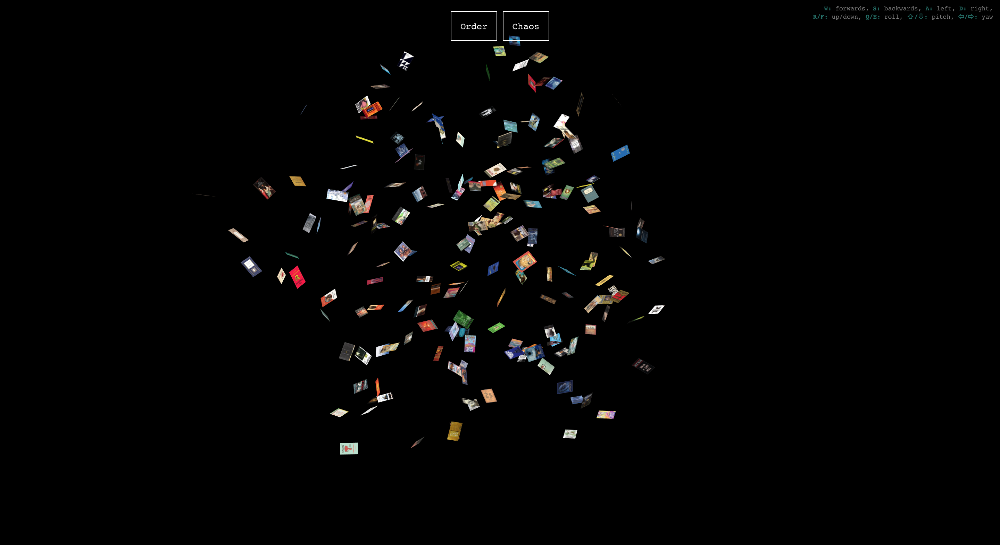

# 3D WebGL Bookshelf #

Try it out here: https://wobkat.github.io/WebGL-bookshelf

Clicking a book cover image should open a new browser window to a page where you can purchase the book.

If this isn't working, you may have to disable your browser's pop-up blocker.

# Controls #

<b>W:</b> forwards, <b>S:</b> backwards, <b>A:</b> left, <b>D:</b> right,
<b>R/F:</b> up/down, <b>Q/E:</b> roll, <b>&#8679;/&#8681;:</b> pitch, <b>&#8678;/&#8680;:</b> yaw 

`Order` button cleans things up:

`Chaos` button stirs things up:

# Notes on Data #

To visualize your own set of books:

1) Create a new CSV file using `data/books.csv` as a reference 

2) Clean up any empty rows in your CSV by running the `data/trim_empty_csv_rows.py` Python script

3) Convert your CSV file to JSON in the expected `books.js` file by running the `data/csv_to_json.py` Python script

4) Open `index.html` in your favorite web browser

